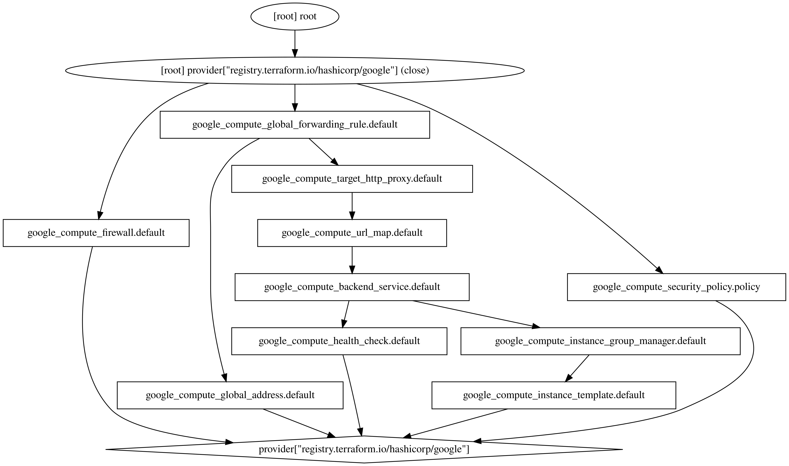

**Notas**

## Commands Terraform 

~~~bash
terraform graph | dot -Tsvg > image.svg
~~~
La opción ```graph``` sé utiliza para mostrar un gráfico de ejecución visual de los recursos
de terraform según la configuración actual o un plan de ejecución.
El comando ```dot``` es parte de una visualización parar generar representaciones visuales de gráficos
descritos en el lenguaje ```dot```.

#### Ejemplo



```bash
dot -Tsvg input.dot -o outoput.svg
```
Este es un comando que forma el ```input.dot``` archivo. Lo convierte a formato SVG y guarda la 
salida como ```output.svg```. El ```-Tsvg``` especifica el formato de salida como SVG y el ```-o output.svg```
especifica el nombre del archivo de salida como ```output.svg```. Asegure tener instalado ```Graphviz``` en su sisteman.

